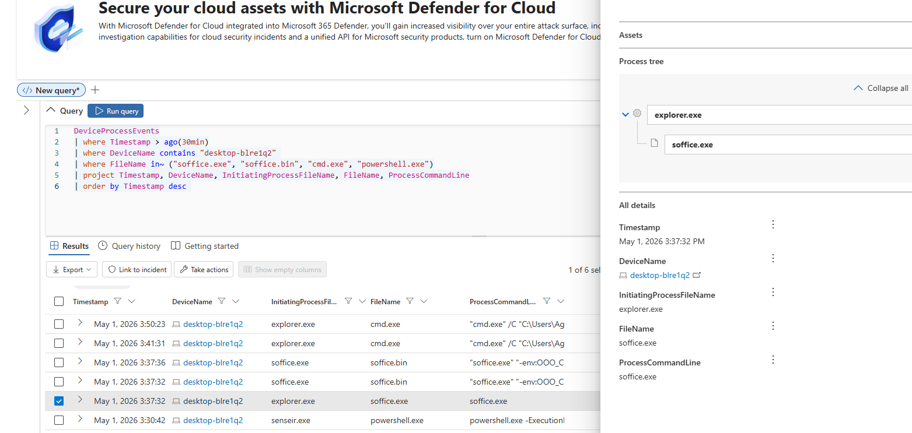
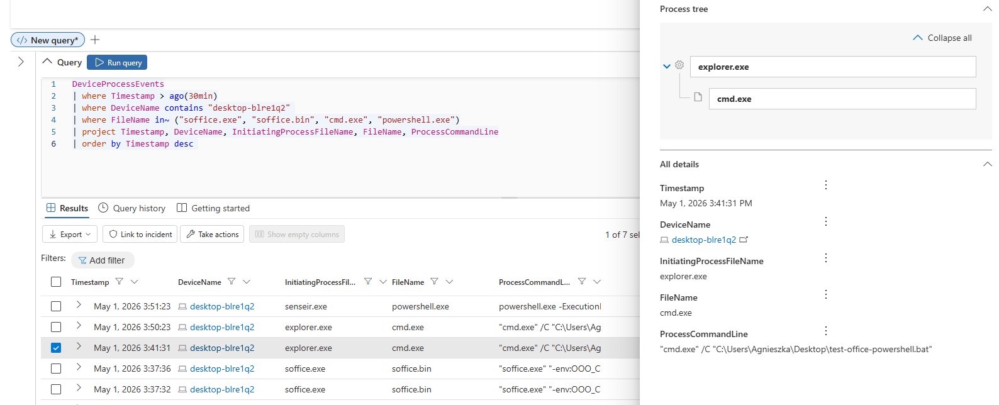

# Defender Incident Investigation

## Objective

Investigate suspicious script execution observed during an active office-user workflow using Microsoft Defender XDR telemetry.

## Scenario

Suspicious command-line activity was observed shortly after a user launched LibreOffice Writer on a Windows endpoint onboarded to Microsoft Defender for Endpoint.

The objective was to determine whether the observed shell and PowerShell activity was consistent with benign user behavior or required escalation as suspicious execution.

## Alert Context

| Field | Value |
|---|---|
| Device | desktop-blre1q2 |
| User | Agnieszka |
| Initial Activity | LibreOffice launch |
| Suspicious Activity | Shell execution from desktop context |
| Follow-on Activity | PowerShell execution |
| Data Source | Microsoft Defender XDR Advanced Hunting |

## Investigation Workflow

1. Review process execution timeline
2. Identify baseline user activity
3. Analyze suspicious shell execution
4. Review command-line behavior
5. Correlate follow-on PowerShell activity
6. Review Defender follow-up telemetry
7. Determine verdict
8. Recommend response actions

## Baseline Activity

Normal user activity showed expected office application execution:

```text
explorer.exe → soffice.exe → soffice.bin
```

This established expected office-user activity and normal process lineage for LibreOffice execution.



## Suspicious Activity

Shortly after office activity, suspicious shell execution was observed from user desktop context:

```text
explorer.exe → cmd.exe
cmd.exe /C C:\Users\Agnieszka\Desktop\test-office-powershell.bat
```

The command originated from the user desktop and executed a batch file that launched PowerShell using execution policy bypass flags.

This behavior is notable because user-context shell execution from desktop paths is commonly associated with:

- script-based execution
- staged payload launch
- initial malware execution
- user-assisted execution chains



## PowerShell Activity

Subsequent PowerShell execution was observed, including encoded command execution during testing:

```text
explorer.exe → powershell.exe
powershell.exe → powershell.exe -enc ...
```

This behavior is commonly associated with:

- obfuscated script execution
- encoded payload delivery
- PowerShell-based malware staging
- execution policy bypass tradecraft

## Defender Telemetry

Microsoft Defender follow-up telemetry collection was observed after suspicious PowerShell execution:

```text
senseir.exe → powershell.exe
```

This indicates Microsoft Defender sensor follow-up collection in response to suspicious script execution and confirms successful telemetry capture by Defender for Endpoint.

## Data Sources

- Microsoft Defender XDR
- Microsoft Defender for Endpoint
- Advanced Hunting
- DeviceProcessEvents

## MITRE ATT&CK Mapping

| Technique | ID |
|---|---|
| User Execution | T1204 |
| PowerShell | T1059.001 |
| Windows Command Shell | T1059.003 |
| Command and Scripting Interpreter | T1059 |

## Verdict

Suspicious.

The observed activity did not indicate confirmed malicious execution, but the command-line pattern, desktop-based script execution and PowerShell follow-on activity were sufficiently suspicious to warrant triage and further investigation.

## Response Actions

- Review full PowerShell command-line arguments
- Validate batch file contents
- Review file origin and creation source
- Review related network connections
- Review additional child process activity
- Validate user intent
- Escalate if persistence, download activity or credential access is observed
