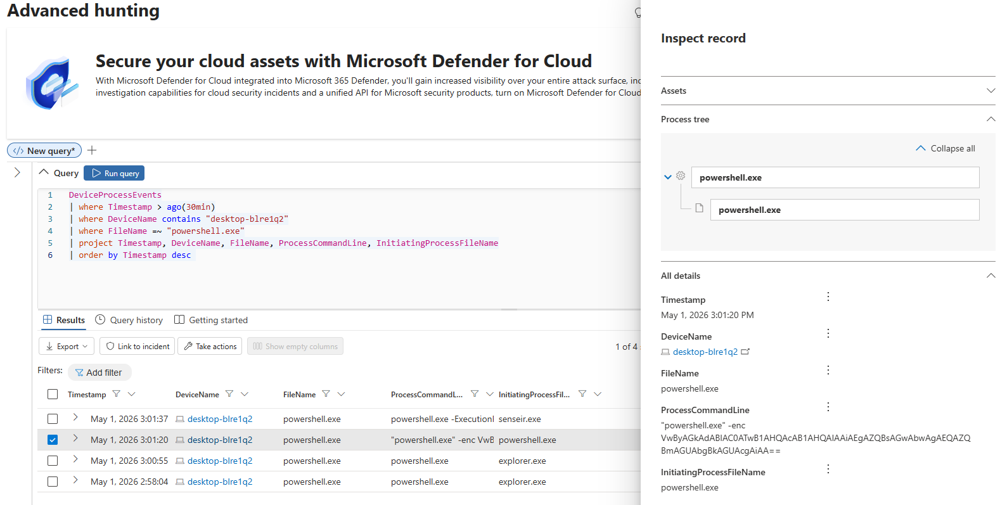

# KQL Hunt Pack

## Objective

Create practical KQL hunting queries for Microsoft Defender XDR Advanced Hunting focused on suspicious process execution, endpoint telemetry and attacker tradecraft.

## Hunt Categories

1. Suspicious PowerShell execution
2. Office spawning script interpreters
3. LOLBins abuse
4. Suspicious outbound connections
5. Persistence via Run Keys
6. Encoded command execution
7. Infostealer-like behavior

## Data Sources

- DeviceProcessEvents
- DeviceNetworkEvents
- DeviceFileEvents
- DeviceRegistryEvents
- DeviceLogonEvents

## Detection Focus

This hunt pack focuses on identifying suspicious Windows process execution patterns commonly associated with:

- PowerShell abuse
- Office child process anomalies
- LOLBins
- script-based execution
- registry persistence
- suspicious outbound connections
- malware staging and execution

## Lab Validation

The suspicious PowerShell hunt query was validated in Microsoft Defender XDR Advanced Hunting against a Windows VM onboarded to Defender for Endpoint.

Observed behavior included:

- interactive PowerShell execution
- encoded PowerShell execution
- Defender follow-up telemetry collection (`senseir.exe`)

## Validation Screenshot

