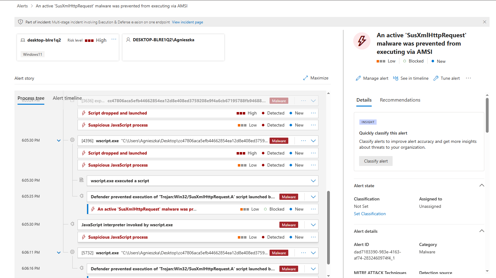

# Malware Triage + Detection

## Objective

Perform practical malware triage on a commodity infostealer sample to identify execution behavior, credential access patterns, collection logic and detection opportunities.

This case focuses on RedLine Stealer as a representative Windows infostealer family commonly associated with credential theft, browser data collection and staged exfiltration.

## Sample Overview

| Field | Value |
|---|---|
| Family | RedLine Stealer |
| Type | Windows Infostealer |
| Platform | Windows |
| Primary Objective | Credential theft and data exfiltration |
| Analysis Focus | Behavior, collection, detection |

## Behavioral Summary

RedLine Stealer is a commodity infostealer designed to collect sensitive user data from infected Windows endpoints.

Observed behavior typically includes:

- system profiling
- browser credential theft
- browser cookie theft
- crypto wallet targeting
- file collection
- archive staging
- outbound exfiltration

## Execution Flow

Typical RedLine execution flow:

```text
User Execution
    ↓
Payload Launch
    ↓
System Profiling
    ↓
Browser Data Collection
    ↓
Credential Harvesting
    ↓
Archive / Staging
    ↓
C2 / Exfiltration
```

## Persistence

RedLine may establish persistence depending on delivery chain and loader behavior, commonly via:

- Run key modification
- Startup folder persistence
- scheduled task creation

Persistence is delivery-dependent and not always present in all observed infections.

## Network Activity

Typical network behavior includes:

- outbound HTTP/HTTPS connections
- C2 beaconing
- host profiling / victim registration
- exfiltration of collected data
- occasional secondary payload retrieval

## Credential Access

RedLine commonly targets:

- browser saved credentials
- browser cookies
- autofill data
- crypto wallet extensions
- FTP / VPN clients
- messaging / communication apps

Common browser targets include:

- Chrome
- Edge
- Brave
- Opera
- Firefox

## Indicators of Compromise (IOCs)

Common IOC categories:

- suspicious archive creation
- browser credential database access
- access to browser profile paths
- outbound connections to uncommon hosts
- temporary staging directories
- suspicious PowerShell or script execution
- execution from user-writable directories

## Detection Opportunities

High-value detection opportunities include:

- browser credential store access
- archive creation in temp / user paths
- suspicious outbound exfiltration
- PowerShell or script-based staging
- access to wallet extension paths
- process execution from user-writable directories
- suspicious file collection behavior

## MITRE ATT&CK Mapping

| Technique | ID |
|---|---|
| User Execution | T1204 |
| PowerShell | T1059.001 |
| Command and Scripting Interpreter | T1059 |
| Credentials from Password Stores | T1555 |
| Archive Collected Data | T1560 |
| Exfiltration Over Web Service | T1567 |
| Data from Local System | T1005 |

## Verdict

RedLine Stealer is a high-volume commodity infostealer with strong detection value for defender workflows.

Its behavior is highly relevant for practical detection engineering because it combines:

- user execution
- credential access
- collection
- staging
- exfiltration

This makes it a strong malware family for building practical detection content across Defender XDR, KQL hunting and Sentinel analytics.

## Practical IOC Examples

| IOC Category | Example |
|---|---|
| Execution Path | `%AppData%`, `%Temp%`, user-writable directories |
| Browser Access | `Login Data`, `Cookies`, `Web Data` |
| Wallet Access | browser extension wallet paths |
| Staging | temporary archive creation in user profile |
| Network | outbound HTTP/HTTPS to uncommon external hosts |
| Script Activity | suspicious PowerShell / script execution |
| Collection | browser profile and credential store access |

## Detection Ideas

### 1. Detect suspicious access to browser credential stores

Monitor for processes accessing:

- `Login Data`
- `Cookies`
- `Web Data`

outside expected browser context.

### 2. Detect archive creation in user-writable paths

Monitor for archive creation in:

- `%Temp%`
- `%AppData%`
- `%UserProfile%`

especially following browser data access.

### 3. Detect suspicious outbound exfiltration

Monitor for outbound connections shortly after:

- browser profile access
- archive creation
- script execution

### 4. Detect PowerShell or script-based staging

Monitor for:

- encoded PowerShell
- suspicious script interpreters
- execution policy bypass
- staging from user directories

### 5. Detect access to wallet extension paths

Monitor for access to browser extension directories commonly associated with crypto wallets.

## Detection Mapping

| Behavior | Defender Signal | Hunting Focus | Detection Value |
|---|---|---|---|
| User execution | DeviceProcessEvents | suspicious parent-child process chains | initial access / execution |
| Script staging | DeviceProcessEvents | PowerShell, cmd, encoded execution | script-based execution |
| Browser credential access | DeviceFileEvents | access to browser credential stores | credential theft |
| Archive staging | DeviceFileEvents | archive creation in temp / user paths | collection / staging |
| Outbound exfiltration | DeviceNetworkEvents | suspicious outbound connections | exfiltration |
| Persistence | DeviceRegistryEvents | Run Keys / startup modifications | persistence |
| Wallet targeting | DeviceFileEvents | browser extension access | crypto theft |

## Analyst Takeaway

RedLine is a strong malware family for practical defender-focused analysis because it provides clear and repeatable signals across:

- execution
- credential access
- collection
- staging
- exfiltration

This makes it highly suitable for:

- malware triage
- KQL hunting
- Defender investigation
- Sentinel detection engineering
- practical incident response


## Live Detonation Notes

A RedLine-associated JavaScript sample was executed in an isolated Windows VM instrumented with Microsoft Defender for Endpoint.

The sample was launched via Windows Script Host and triggered Microsoft Defender detection during execution.

Defender generated an alert and blocked execution via AMSI:

> An active 'SusXmlHttpRequest' malware was prevented from executing via AMSI

Observed execution characteristics:

- script-based initial execution
- Windows Script Host execution (`wscript.exe` / `cscript.exe`)
- Defender AMSI interception
- alert-level detection in Microsoft Defender
- partial execution likely influenced by virtualized environment artifacts

The sample executed in a VirtualBox guest environment. Virtualization artifacts (e.g. `VBoxTray.exe`) were present in process context and may have influenced execution behavior.

This likely reduced full post-exploitation behavior while still allowing pre-execution detection and telemetry capture.


